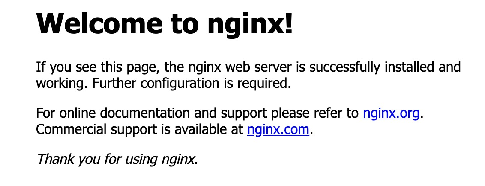

# Projet UF Réseau
Ynov Informatique B2A - Repository du projet UF Réseaux - Thomas Le Naour / Alex Boisseau

## Etape 1 : Sécuriser le VPS

* Mettre à jour le système `apt-get update` && `apt-get upgrade`.
* Changer de port (pour éviter les attaques "en masse" sur le port de base qui est le port 22)  
    *  Changer le port 22 dans le fichier `/etc/ssh/sshd_config`. (Décommenter la ligne en changeant le port)
* Redémarrer le service ssh `/etc/init.d/ssh restart`.  
* Pour se connecter en ssh il faudra rajouter une option où on spécifie le port choisi (`ssh root@IPDUSERVEUR -p PORT`). 
* Changer le mot de passe de l'utilisateur root (le seul pour le moment) -> `passwd root`. Ne jamais se connecter avec l'utilisateur `root` après avoir créé son premier utilisateur.
* Créer le nouvel utilisateur `adduser NOUVELUTILISATEUR`. Rentrer les données qui sont demandées et choisir un mot de passe(mélanger les caractères etc...)
* Empecher l'utilisateur `root` de se connecter au serveur via protocole ssh. Pour cela, on se rend dans le fichier `/etc/ssh/sshd_config`. A la ligne `PermitRootLogin' et mettre `no`.
* Redémarrer le service ssh `/etc/init.d/ssh restart`. 
* Installer le logiciel `Fail2Ban`. Ce logiciel permet de "stocker" les adresses IPs autorisées à acceder au serveur. Pour l'installer -> `apt-get install fail2ban`.
* Configurer `fail2ban` : se rendre ans le fichier (normalement vide) `/etc/fail2ban/jail.d/defaults-debian.conf` puis y ajouter

```
[sshd]
enabled = true
maxretry = 5
findtime = 180
bantime = 3600
```

* Ajouter un utilisateur au groupe `sudo` (permet à cet utilisateur d'utiliser sudo.) -> `usermod -a -G sudo NOMUTILISATEUR`.  
* On va maintenant générer une paire de clé ssh pour sécuriser les connexions. Nous devons donc créer une paire sur notre ordinateur `ssh-keygen` puis mettre notre clé public sur le serveur `ssh-copy-id user@ip_server`.
* A partir de ce moment les connexion via paires de clés (privés/public) sont possibles. On enlève la possibilité de se connecter au serveur via login/mdp dans le fichier /etc/ssh/sshd_config en passant la ligne `PasswordAuthentification` à `no`.

## Etape 2 : Apache

* Installer Apache : `apt-get install apache2 -y`
* Démarrer Apache et l'activer : `systemctl start apache2` et `systemctl enable apache2`.

## Etape 3 : Installer NGINX

* Installer NGINX : `sudo apt-get install nginx`.
* Installer ufw : `sudo apt-get install ufw`. Permet de configurer le pare-feu. On peut voir les différentes application qui sont autorisées à tourner par le pare-feu : `sudo ufw app list`. On va maintenant autorisé le trafic uniquement sur le port 80(pour l'instant) `sudo ufw allow 'Nginx HTTP'`.
* On vérifie que le système est bien en place : `systemctl status nginx`.         
* En tappant `http://ADRESSE_IP` dans votre navigateur vous devrez tomber sur la page de chargement de NGINX.
    * Résultat : 


## 


